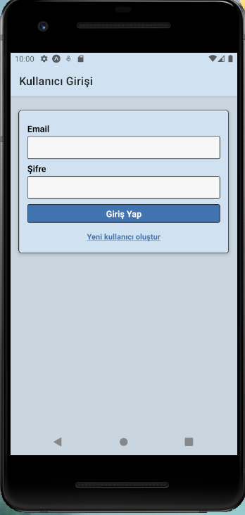
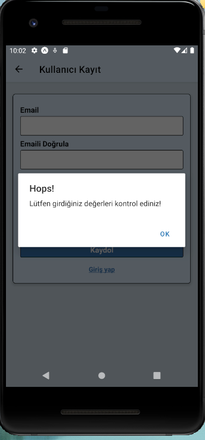
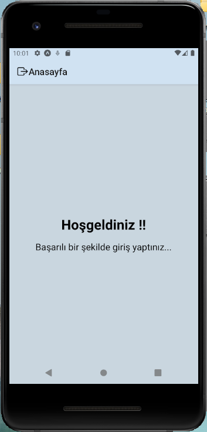

# React Native Firebase Kullanıcı Giriş Uygulaması

Bu proje, React Native ve Google Firebase kullanılarak geliştirilmiş temel bir kullanıcı kimlik doğrulamauygulamasıdır. Kullanıcıların e-posta ve şifre ile kayıt olmasını, giriş yapmasını ve bir anasayfaya erişmesini sağlar.

## Ekran Görüntüleri

| Giriş Ekranı | Kayıt Ekranı | Hata Mesajı | Anasayfa |
| :---: | :---: | :---: | :---: |
|  |  |  |  |

## Özellikler

- **Kullanıcı Kaydı:** E-posta ve şifre ile yeni kullanıcı oluşturma.
- **Kullanıcı Girişi:** Mevcut kullanıcıların sisteme giriş yapması.
- **Firebase Entegrasyonu:** Kullanıcı bilgilerinin `Firebase Authentication` servisinde güvenli bir şekilde saklanması.
- **Giriş Doğrulama (Validation):** E-posta formatı, şifre eşleşmesi gibi temel kontroller.
- **Korumalı Rota (Protected Route):** Sadece giriş yapmış kullanıcıların erişebileceği anasayfa.
- **Modern Arayüz:** `React Navigation` ile yönetilen, temiz ve kullanıcı dostu ekran.

## Kullanılan Teknolojiler

- React Native
- Google Firebase
- React Navigation
- JavaScript 
